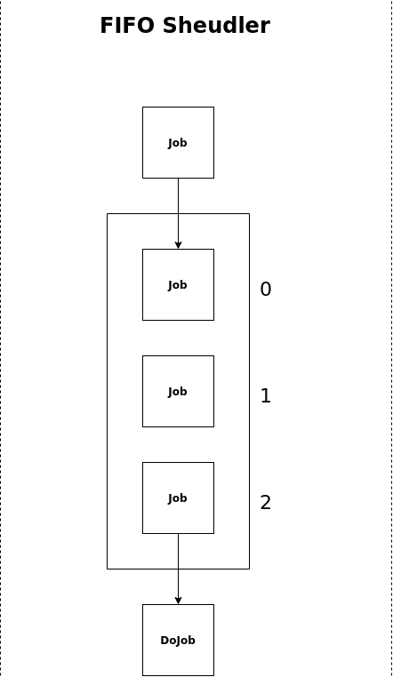

# Usage

FIFO scheduler: schedule jobs that will be ran in FIFO order sequentially.



## Example 
```go 
package main 

import (
	"github.com/donutloop/toolkit/schedule"
	"log"
)

func main() {
        // creation of jobs

		s := schedule.NewFIFOScheduler()
    	defer s.Stop()
    
    	for _, job := range jobs {
    		s.Schedule(job)
    	}
    
    	s.WaitFinish(100)
}
```